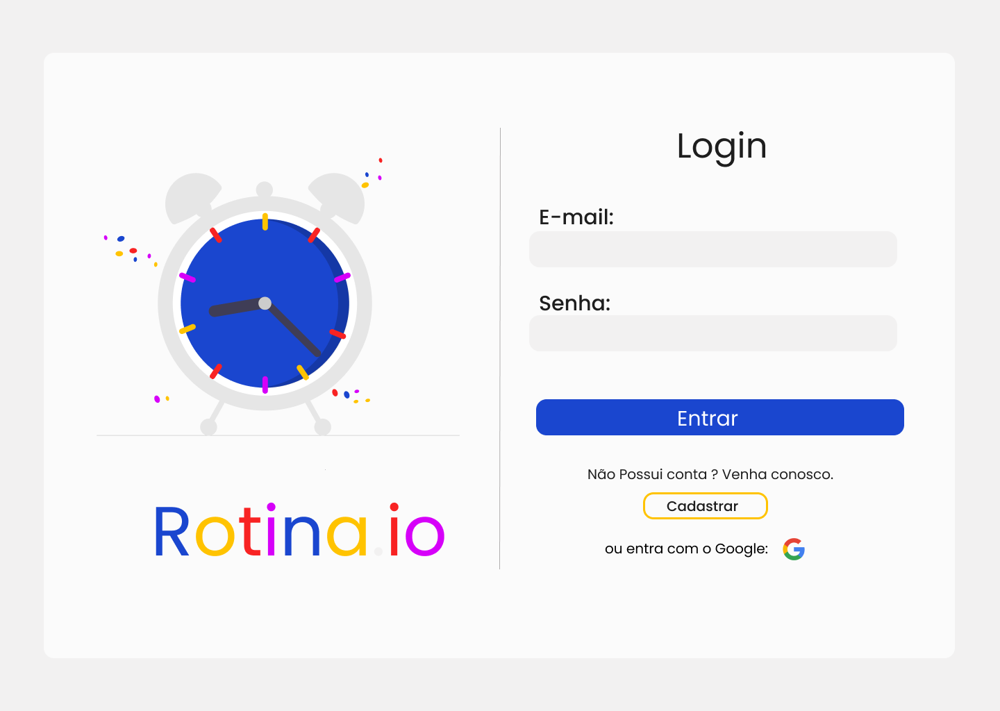
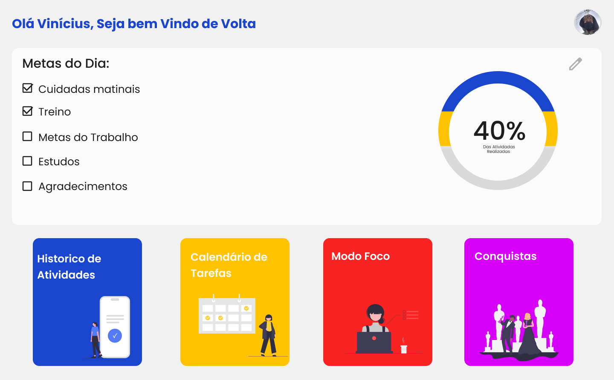
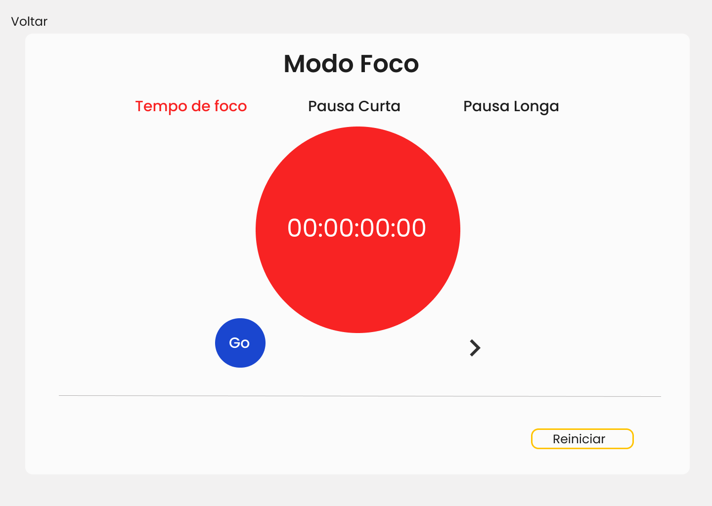

<h1 align="center">

Rotina.io

</h1>

Sistema para ajudar o usuário a administrar suas rotina, com listas de afazeres além de diversos outros recursos, como modo foco e previsão do tempo, visando ajudar o usuário em seu dia dia.
# Resumo:
- Tecnologias Usadas;
- Sobre o projeto;
- Como Rodar o Projeto;
- Design;
- Banco de Dados;

# Tecnologias Usadas e que serão implementadas :
- Figma;
- HTML;
- CSS;
- Xampp;
- JS;
- PHP;

  # ​📍​ Sobre o Rotinha.io

O Rotina.io foi criado com a intenção de ajudar pessoas em seus deveres do dia-dia, não só mostrando sua lista de tarefas, mas sim com o apoio necessário para que todas as metas dos usuários sejam cumpridas para isso temos diversas ferramentas, como um gráfico que mostra quantas tarefas já foram realizadas, um modo foco, uma parte que mostra a previsão do tempo e muito mais.
Além disso o sistema foi criado como uma forma de eu aprender e me desafiar fazendo algo que amo, no caso programar.

  # ⚙️​ Como Rodar o Projeto
  No presente momento, é necessário apenas baixar o arquivo em sua maquína e rodar no navegador.

  # ​🖼️​ Design

Para o design utilizei o Figma, para o projeto pensei em algo simples mas que tivesse diversas cores e que tivesse uma desing minimalista e com estili mais descontraido, por isso escolhi o branco como principal e mais outras 4 cores. 

# 📕Banco de Dados
O Banco de dados ainda não foi construido mas logo será implementado e usará do xampp.
